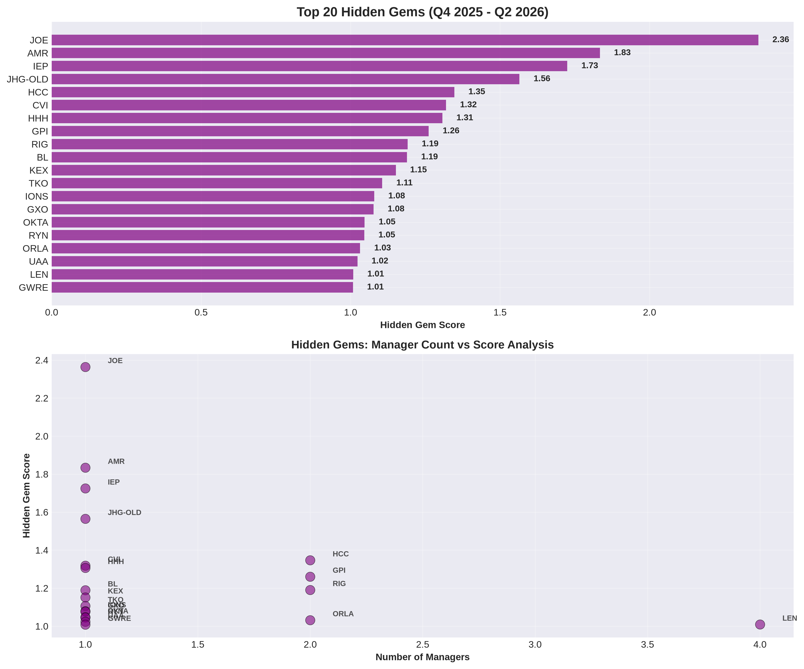

# 📊 Dataroma Investment Analysis

*Generated: 2026-07-20 20:15:50*

## 🎯 Overview

This analysis covers **19+ years** of investment data from top money managers, providing insights into current opportunities, manager performance patterns, and long-term investment trends.

### 📈 Quick Stats
- **Total Activities Analyzed**: 55,120
- **Current Holdings**: 4,298
- **Managers Tracked**: 84
- **Time Period**: 2007-2026

---

## 💡 Current Analysis (Last 3 Quarters)

Immediate opportunities and recent market activity from Q4 2023 to Q4 2025.

### 📊 Visual Analysis

#### 52 Week Analysis Current

#### Hidden Gems Current

#### Low Price Accumulation Current

#### Momentum Analysis Current

#### New Positions Current

#### Portfolio Changes Current

#### Price Opportunities Current

### 📋 Current Reports

| Report | Description | Key Insight |
| ------ | ----------- | ----------- |
| [52_week_high_sells.csv](current/52_week_high_sells.csv) | Profit taking patterns (40 items) | Strategic exits at peaks |
| [52_week_low_buys.csv](current/52_week_low_buys.csv) | Value hunting activity (40 items) | Managers buying at market lows |
| [concentration_changes.csv](current/concentration_changes.csv) | Portfolio shifts (100 items) | Major allocation adjustments |
| [contrarian_opportunities.csv](current/contrarian_opportunities.csv) | Against-the-trend plays (30 items) | Institutional contrarian bets |
| [deep_value_plays.csv](current/deep_value_plays.csv) | Deep value opportunities (30 items) | Undervalued institutional picks |
| [hidden_gems.csv](current/hidden_gems.csv) | Under-the-radar opportunities (50 items) | 5-factor scoring identifies stocks with high potential |
| [high_conviction_low_price.csv](current/high_conviction_low_price.csv) | Best value + conviction combo (25 items) | High conviction meets low price |
| [highest_portfolio_concentration.csv](current/highest_portfolio_concentration.csv) | Most focused positions (100 items) | Highest concentration institutional bets |
| [momentum_stocks.csv](current/momentum_stocks.csv) | Recent buying activity (50 items) | Tracks institutional accumulation patterns |
| [most_sold_stocks.csv](current/most_sold_stocks.csv) | Recent exit activity (50 items) | Most divested institutional positions |
| [new_positions.csv](current/new_positions.csv) | Fresh acquisitions (100 items) | Identifies emerging manager interests |
| [stocks_under_$5.csv](current/stocks_under_$5.csv) | Ultra-low price opportunities (22 items) | Deep value plays under $5 |
| [stocks_under_$10.csv](current/stocks_under_$10.csv) | Sub-$10 opportunities (50 items) | Manager favorites under $10 |
| [stocks_under_$20.csv](current/stocks_under_$20.csv) | Affordable growth plays (50 items) | Quality stocks at accessible prices |
| [stocks_under_$50.csv](current/stocks_under_$50.csv) | Mid-price value plays (50 items) | Institutional picks under $50 |
| [stocks_under_$100.csv](current/stocks_under_$100.csv) | Sub-$100 opportunities (50 items) | Value plays under $100 |
| [under_radar_picks.csv](current/under_radar_picks.csv) | Hidden gem opportunities (7 items) | Under-the-radar institutional picks |
| [value_price_opportunities.csv](current/value_price_opportunities.csv) | Multi-tier price analysis (40 items) | Comprehensive price-based screening |
| [stock_timelines.csv](current/stock_timelines.csv) | Position timeline tracking (200 items) | Quarter-by-quarter position changes per stock |

### 🌟 Top 5 Hidden Gems

| Ticker | Score | Price | Managers |
| ------ | ----- | ----- | -------- |
| **JOE** | 2.36 | $0.00 | Bruce Berkowitz |
| **AMR** | 1.83 | $0.00 | Mohnish Pabrai |
| **IEP** | 1.73 | $0.00 | Carl Icahn |
| **JHG-OLD** | 1.56 | $0.00 | Nelson Peltz |
| **HCC** | 1.35 | $0.00 | Mohnish Pabrai, Third Avenue Management |

---

## 🧠 Advanced Analysis (Manager Performance)

Deep insights into manager strategies, performance patterns, and decision-making.

### 📊 Visual Analysis

#### 10 Year Performance

#### 3 Year Performance

#### 5 Year Performance

#### Accumulation Distribution Advanced

#### Comprehensive Performance

#### Consensus Picks Advanced

#### Crisis Alpha Advanced

#### Manager Evolution Advanced

#### Manager Performance Advanced

#### Position Sizing Advanced

#### Top Holdings Advanced

### 📋 Advanced Reports

| Report | Description | Key Insight |
| ------ | ----------- | ----------- |
| [position_building_timeline.csv](advanced/position_building_timeline.csv) | 📈 Position buildup/reduction over time (40943 items) | Quarter-by-quarter view of how managers accumulate & distribute positions |
| [accumulation_vs_distribution.csv](advanced/accumulation_vs_distribution.csv) | 🔄 Current phase tracking (100 items) | Identifies which positions are being built vs reduced RIGHT NOW |
| [position_flip_points.csv](advanced/position_flip_points.csv) | 🔀 Accumulation→Distribution transitions (94 items) | Pinpoints when managers switched from building to reducing |
| [action_sequence_patterns.csv](advanced/action_sequence_patterns.csv) | Trading pattern analysis (30 items) | Institutional buy/sell sequence patterns |
| [catalyst_timing_masters.csv](advanced/catalyst_timing_masters.csv) | Market timing excellence (30 items) | Managers with exceptional timing skills |
| [crisis_alpha_generators.csv](advanced/crisis_alpha_generators.csv) | Crisis period outperformers (30 items) | Managers who buy during crashes |
| [high_conviction_stocks.csv](advanced/high_conviction_stocks.csv) | Highest conviction positions (246 items) | Stocks with strongest institutional backing |
| [interesting_stocks_overview.csv](advanced/interesting_stocks_overview.csv) | Top-tier opportunities (100 items) | Multi-factor scoring of elite picks |
| [long_term_winners.csv](advanced/long_term_winners.csv) | Sustained institutional interest (63 items) | Stocks with long-term institutional backing |
| [manager_evolution_patterns.csv](advanced/manager_evolution_patterns.csv) | Strategy adaptation over time (30 items) | How managers evolve their approaches |
| [manager_performance.csv](advanced/manager_performance.csv) | Comprehensive manager evaluation (83 items) | Multi-dimensional performance metrics |
| [manager_track_records.csv](advanced/manager_track_records.csv) | Multi-year activity history (84 items) | Comprehensive manager scoring with consistency |
| [multi_manager_favorites.csv](advanced/multi_manager_favorites.csv) | Consensus high-conviction picks (50 items) | Stocks held by multiple elite managers |
| [position_sizing_mastery.csv](advanced/position_sizing_mastery.csv) | Optimal allocation patterns (40 items) | Advanced portfolio construction analysis |
| [sector_rotation_excellence.csv](advanced/sector_rotation_excellence.csv) | Elite sector allocation (30 items) | Superior sector rotation strategies |
| [sector_rotation_patterns.csv](advanced/sector_rotation_patterns.csv) | Institutional sector flows (331 items) | Sector rotation trend analysis |
| [theme_emergence_detection.csv](advanced/theme_emergence_detection.csv) | Early theme identification (25 items) | Emerging investment theme detection |
| [top_holdings.csv](advanced/top_holdings.csv) | Largest institutional positions (50 items) | Deep dive into major institutional holdings |

### 🏆 Top 15 Managers by Track Record Score (2007-2026)

| Rank | Manager | Score | Years Active | Total Actions |
| ---- | ------- | ----- | ------------ | ------------- |
| 1 | **Pat Dorsey** | 30.57 | 10 | 392 |
| 2 | **Chuck Akre** | 29.54 | 15 | 1000 |
| 3 | **ValueAct Capital** | 29.33 | 15 | 649 |
| 4 | **Robert Vinall** | 29.18 | 8 | 148 |
| 5 | **Carl Icahn** | 28.90 | 14 | 328 |
| 6 | **Glenn Greenberg** | 28.74 | 15 | 1000 |
| 7 | **Clifford Sosin** | 28.44 | 9 | 117 |
| 8 | **Thomas Gayner** | 28.20 | 6 | 1000 |
| 9 | **Bill Ackman** | 28.18 | 20 | 417 |
| 10 | **Warren Buffett** | 27.84 | 18 | 1000 |
| 11 | **Nelson Peltz** | 27.51 | 12 | 280 |
| 12 | **Valley Forge Capital Management** | 27.35 | 8 | 124 |
| 13 | **Greenhaven Associates** | 27.15 | 8 | 614 |
| 14 | **Prem Watsa** | 27.07 | 15 | 1000 |
| 15 | **Josh Tarasoff** | 27.00 | 8 | 243 |

---

## 📚 Historical Analysis (19+ Years)

Long-term trends and patterns from 2007 to 2026.

### 📊 Visual Analysis

#### Crisis Response Comparison

#### Multi Decade Conviction

#### Quarterly Activity Timeline

#### Stock Life Cycles

### 📋 Historical Reports

| Report | Description | Key Insight |
| ------ | ----------- | ----------- |
| [crisis_response_analysis.csv](historical/crisis_response_analysis.csv) | 2008 vs 2020 comparison (3 items) | Crisis behavior patterns across decades |
| [multi_decade_conviction.csv](historical/multi_decade_conviction.csv) | Stocks held 10+ years (50 items) | Ultimate long-term conviction plays |
| [quarterly_activity_timeline.csv](historical/quarterly_activity_timeline.csv) | Full-history activity map (78 items) | 78 quarters of market timing insights |
| [stock_life_cycles.csv](historical/stock_life_cycles.csv) | Complete holding patterns (3795 items) | Entry/exit patterns and optimal holding periods |

---

## 📐 Methodology

### Scoring Algorithms

#### Hidden Gem Score (0-10)
- **Exclusivity Factor** (30%): Fewer managers = higher score
- **Conviction Factor** (25%): Higher portfolio % = higher score
- **Recent Activity** (20%): Recent buys boost score
- **Momentum Factor** (15%): Multiple recent transactions
- **Manager Quality** (10%): Premium for top-tier managers

#### Track Record Score
Computed as: years_active x 0.3 + consistency_score x 20 + crisis_buying_ratio x 10 + 5 if the manager has current holdings.
- **Consistency**: Stability of activity across observed years
- **Crisis Buying**: Share of buy-side actions during the 2008 / 2020 / 2022 crisis windows
- **Longevity**: Years of observed activity (NOTE: Dataroma caps public history at ~1,000 activities per manager, so very active managers' first observed year is later than their real start)

### Data Processing
- **Quarters**: Parsed from Dataroma period labels; filing period taken from each page
- **Price Data**: From Dataroma HTML at scrape time
- **Manager Mapping**: Clean names without timestamps
- **Activity Types**: Buy, Sell, Add, Reduce, Hold

### Analysis Periods
- **Current**: Q4 2025 - Q2 2026 (last 3 quarters)
- **Historical**: Q1 2007 - Q2 2026

## Understanding the Data

This section provides context for interpreting the analysis results, including edge cases and cross-file relationships.

### Momentum Analysis Details

The momentum analysis tracks institutional accumulation and distribution patterns. Higher scores indicate stronger buying pressure from multiple managers.

#### Top 20 Momentum Stocks

| Ticker | Company | Score | Buy Actions | Holders | Type |
| ------ | ------- | ----- | ----------- | ------- | ---- |
| **MSFT** | Microsoft Corp. | 126.8 | 39 | 40 | Recent Surge |
| **AMZN** | Amazon.com Inc. | 110.1 | 32 | 35 | Recent Surge |
| **META** | Meta Platforms Inc. | 93.5 | 27 | 30 | Recent Surge |
| **V** | Visa Inc. | 82.7 | 23 | 27 | Recent Surge |
| **GOOGL** | Alphabet Inc. | 80.2 | 16 | 40 | Recent Surge |
| **GOOG** | Alphabet Inc. CL C | 73.4 | 14 | 36 | Recent Surge |
| **BRK.B** | Berkshire Hathaway CL B | 71.2 | 16 | 27 | Recent Surge |
| **DIS** | Walt Disney Co. | 70.8 | 21 | 23 | Recent Surge |
| **TSM** | Taiwan Semiconductor S.A. | 56.8 | 13 | 24 | Recent Surge |
| **UNH** | United Health Group Inc. | 56.4 | 16 | 19 | Recent Surge |
| **AAPL** | Apple Inc. | 55.0 | 11 | 25 | Recent Surge |
| **NVDA** | NVIDIA Corp. | 54.3 | 14 | 19 | Recent Surge |
| **MA** | Mastercard Inc. | 49.3 | 10 | 20 | Recent Surge |
| **FISV** | Fiserv Inc. | 49.2 | 17 | 10 | Recent Surge |
| **UBER** | Uber Technologies Inc. | 47.6 | 14 | 12 | Recent Surge |
| **CMCSA** | Comcast Corp. | 46.2 | 13 | 14 | Recent Surge |
| **TMO** | Thermo Fisher Scientific | 45.0 | 13 | 12 | Recent Surge |
| **ADBE** | Adobe Inc. | 44.8 | 14 | 12 | Recent Surge |
| **SPGI** | S&P Global Inc. | 42.9 | 11 | 11 | Recent Surge |
| **SUNB** | Sunbelt Rentals Holdings ... | 42.6 | 11 | 10 | Recent Surge |

**Interpretation:**
- **Recent Surge**: Strong recent accumulation across multiple quarters
- **Consistent Buyer**: Steady accumulation pattern over time
- **New Interest**: Fresh positions being established

### 52-Week Analysis Edge Cases

The 52-week high/low analyses use specific filter criteria that may initially seem counterintuitive:

#### 52-Week Low Buys (`52_week_low_buys.csv`)

This report shows stocks being **bought near their 52-week lows**. The `near_52w_low=True` filter is **intentional** - these are the exact stocks we want to highlight as potential value opportunities.

- **40 stocks** currently meet this criterion
- Examples: CMCSA, CHTR, CRM
- These are being accumulated by value-focused managers

#### 52-Week High Sells (`52_week_high_sells.csv`)

This report shows stocks being **sold near their 52-week highs**. The `near_52w_high=True` filter is **intentional** - these represent profit-taking opportunities where managers are locking in gains.

- **40 stocks** currently meet this criterion
- Examples: AAPL, KO, BAC
- 24 stocks show "Heavy Distribution" patterns

### New Positions Context

The analysis identified **100 new position entries** in the last 3 quarters. These represent fresh institutional interest.

#### Top New Positions by Total Value

| Ticker | Managers Initiating | Total Value | Avg Portfolio % |
| ------ | ------------------- | ----------- | --------------- |
| **SUNB** | Dodge & Cox Funds, Abrams Bison Investments +5 more | $6.14B | 9.19% |
| **DAL** | Warren Buffett | $2.65B | 1.01% |
| **MSFT** | Bill Ackman | $2.09B | 15.26% |
| **ROP** | Dodge & Cox Funds, Bill Nygren | $1.80B | 0.73% |
| **TSLA** | David Katz, Duan Yongping | $1.27B | 3.18% |
| **GOOG** | Warren Buffett | $1.03B | 0.39% |
| **AAPL** | Viking Global Investors | $911.88M | 2.55% |
| **MRSH** | Bill Nygren | $896.58M | 1.20% |
| **META** | Viking Global Investors, Polen Capital Management | $880.64M | 1.79% |
| **WAT** | First Eagle Investment Management, Viking Global Investors | $843.26M | 0.93% |

### Cross-File Context

Some stocks appear in multiple analysis files with seemingly contradictory signals. This is normal and reflects the diverse strategies of different managers.

#### Stocks in Both Contrarian and Momentum Reports

These tickers appear in both `contrarian_opportunities.csv` and `momentum_stocks.csv`. This happens when different managers take opposite positions on the same stock:

- **COF**: Contrarian signal: Net Selling (buys: 5.0, sells: 28.0) | Momentum score: 32.76

- **META**: Contrarian signal: Net Selling (buys: 27.0, sells: 33.0) | Momentum score: 93.48466666666667

- **FISV**: Contrarian signal: Net Buying (buys: 17.0, sells: 9.0) | Momentum score: 49.214

- **MCO**: Contrarian signal: Net Selling (buys: 7.0, sells: 14.0) | Momentum score: 39.57588235294118

- **BRK.B**: Contrarian signal: Net Selling (buys: 16.0, sells: 26.0) | Momentum score: 71.24222222222222

#### New Positions with Contrarian Signals

These newly initiated positions also show contrarian patterns, suggesting managers are taking bold positions against the crowd:
- **META**: New position initiated amid contrarian activity
- **FISV**: New position initiated amid contrarian activity
- **GOOGL**: New position initiated amid contrarian activity

### Data Freshness Notes

**Analysis Window**: Q4 2025 to Q2 2026 (last 3 quarters)

All current analysis reports are based on manager filings within this window. Key points to understand:

1. **Filing Lag**: SEC 13F filings are reported quarterly with a 45-day delay. Positions may have changed since filing.

2. **Historical Reference Columns**: Some reports include columns like `last_buy_period`, `first_established`, or `last_activity`. These may show dates outside the 3-quarter window - this is intentional to provide historical context.

3. **Price Data**: Current prices are from the most recent scrape and may differ from the prices at which positions were established.

4. **Manager Activity**: A single manager may have multiple entries for the same stock if they made multiple transactions (Buy, Add, Reduce) within the analysis window.

**Report Generated**: 2026-07-20 20:15:50

---

## 📅 Update Schedule

This analysis is refreshed monthly to capture the latest investment trends and manager activities.

## 🔗 Data Source

All data is sourced from [Dataroma](https://www.dataroma.com), tracking portfolios of super investors.

---

*Analysis framework powered by modular Python architecture*