# 📊 Dataroma Investment Analysis

*Generated: 2026-01-27 00:09:19*

## 🎯 Overview

This analysis covers **18+ years** of investment data from top money managers, providing insights into current opportunities, manager performance patterns, and long-term investment trends.

### 📈 Quick Stats
- **Total Activities Analyzed**: 57,643
- **Current Holdings**: 3,311
- **Managers Tracked**: 81
- **Time Period**: 2007-2025

---

## 💡 Current Analysis (Last 3 Quarters)

Immediate opportunities and recent market activity recent quarters.

### 📊 Visual Analysis

#### 52 Week Analysis Current
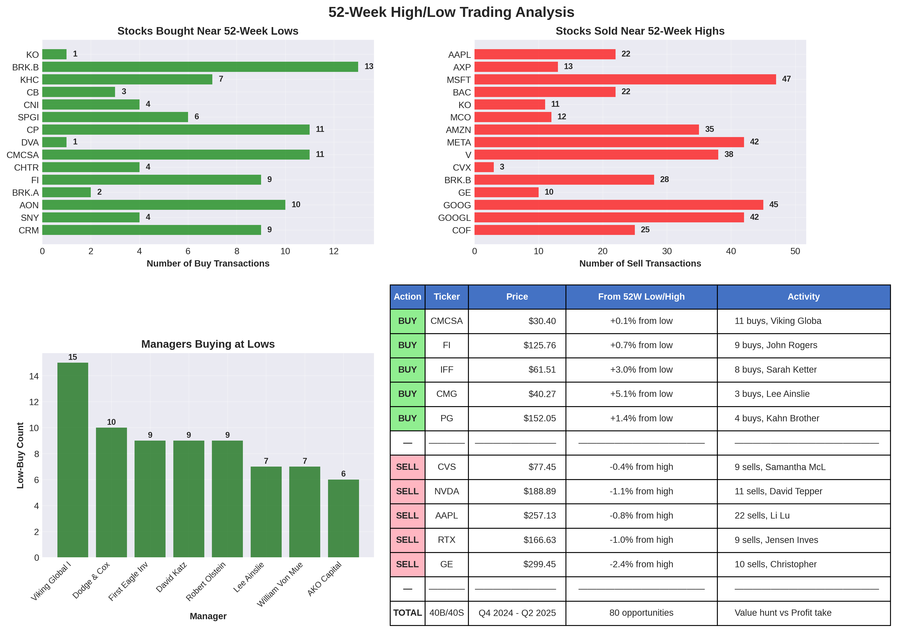

#### Low Price Accumulation Current
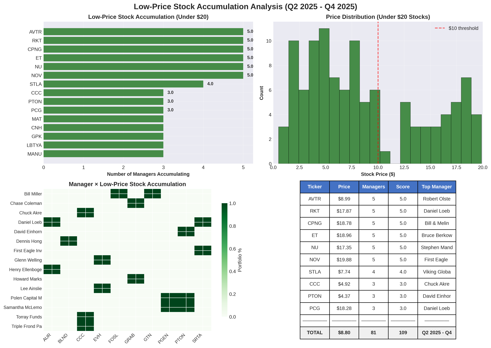

#### Momentum Analysis Current
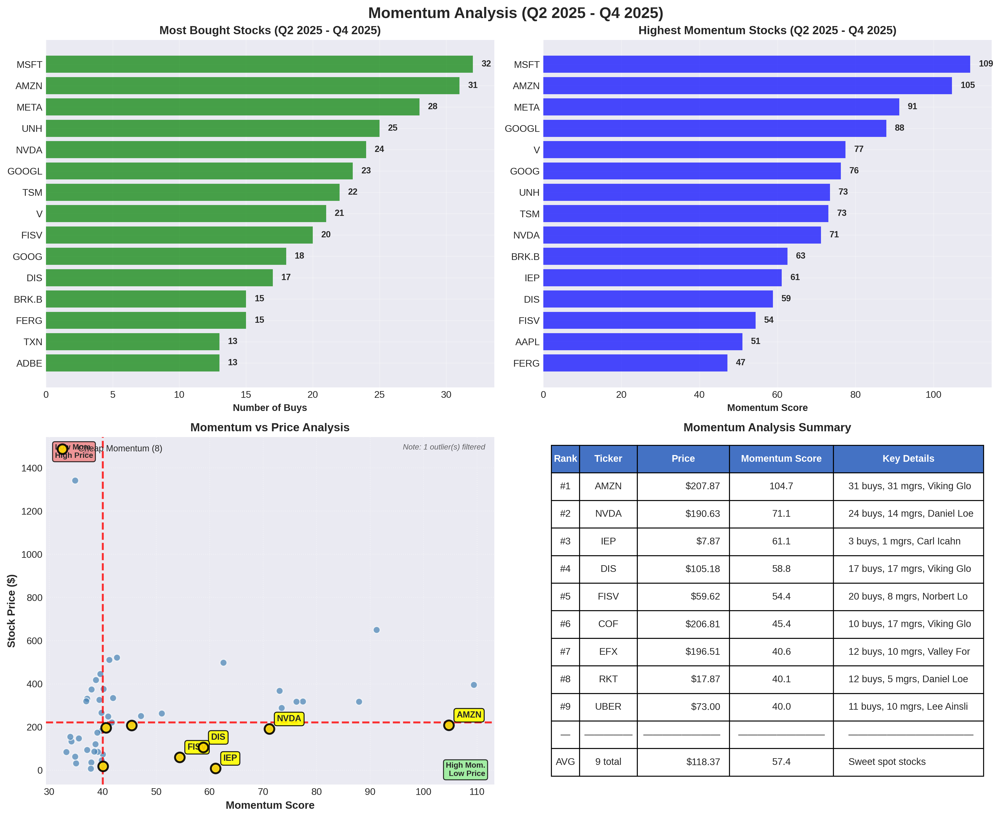

#### New Positions Current
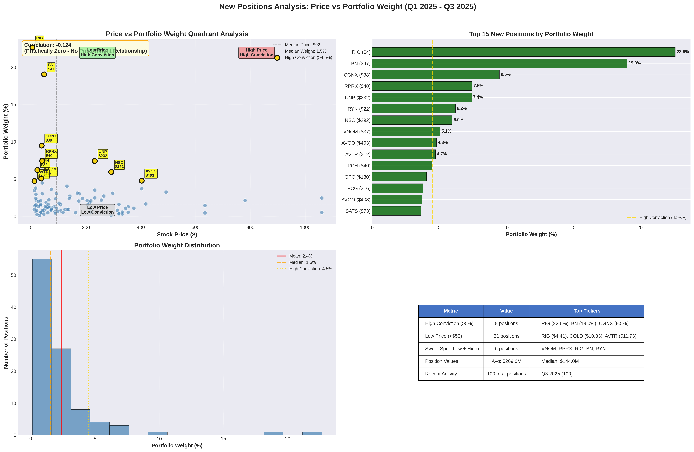

#### Portfolio Changes Current
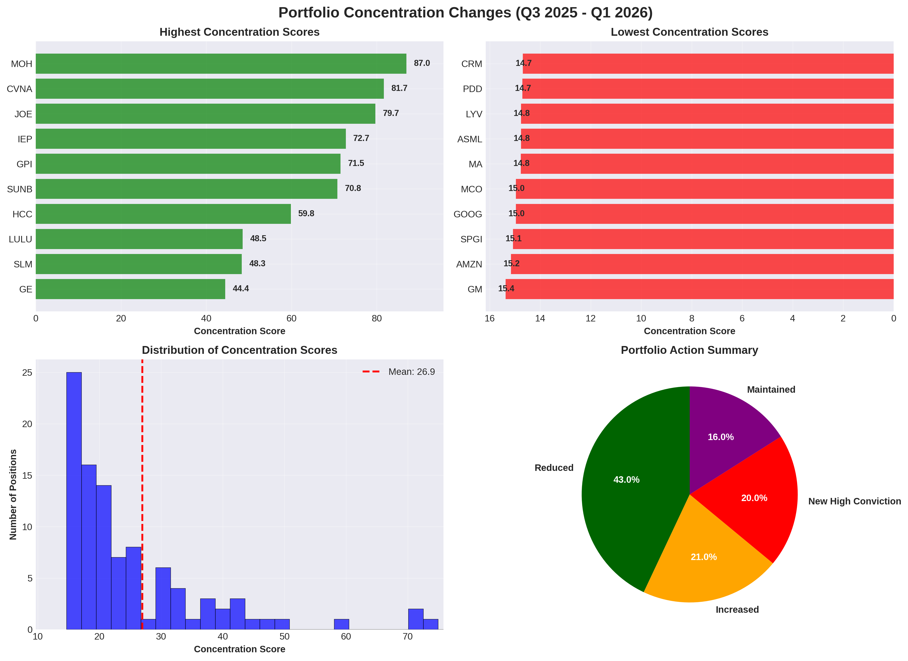

#### Price Opportunities Current
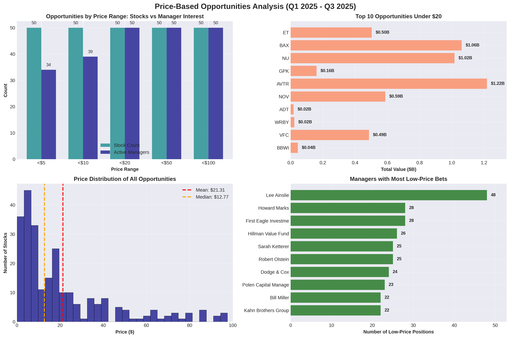

### 📋 Current Reports

| Report | Description | Key Insight |
| ------ | ----------- | ----------- |
| [52_week_high_sells.csv](current/52_week_high_sells.csv) | Profit taking patterns (40 items) | Strategic exits at peaks |
| [52_week_low_buys.csv](current/52_week_low_buys.csv) | Value hunting activity (40 items) | Managers buying at market lows |
| [concentration_changes.csv](current/concentration_changes.csv) | Portfolio shifts (100 items) | Major allocation adjustments |
| [contrarian_opportunities.csv](current/contrarian_opportunities.csv) | Against-the-trend plays (30 items) | Institutional contrarian bets |
| [deep_value_plays.csv](current/deep_value_plays.csv) | Deep value opportunities (30 items) | Undervalued institutional picks |
| [high_conviction_low_price.csv](current/high_conviction_low_price.csv) | Best value + conviction combo (30 items) | High conviction meets low price |
| [highest_portfolio_concentration.csv](current/highest_portfolio_concentration.csv) | Most focused positions (100 items) | Highest concentration institutional bets |
| [momentum_stocks.csv](current/momentum_stocks.csv) | Recent buying activity (50 items) | Tracks institutional accumulation patterns |
| [most_sold_stocks.csv](current/most_sold_stocks.csv) | Recent exit activity (50 items) | Most divested institutional positions |
| [new_positions.csv](current/new_positions.csv) | Fresh acquisitions (100 items) | Identifies emerging manager interests |
| [stocks_under_$5.csv](current/stocks_under_$5.csv) | Ultra-low price opportunities (50 items) | Deep value plays under $5 |
| [stocks_under_$10.csv](current/stocks_under_$10.csv) | Sub-$10 opportunities (50 items) | Manager favorites under $10 |
| [stocks_under_$20.csv](current/stocks_under_$20.csv) | Affordable growth plays (50 items) | Quality stocks at accessible prices |
| [stocks_under_$50.csv](current/stocks_under_$50.csv) | Mid-price value plays (50 items) | Institutional picks under $50 |
| [stocks_under_$100.csv](current/stocks_under_$100.csv) | Sub-$100 opportunities (50 items) | Value plays under $100 |
| [under_radar_picks.csv](current/under_radar_picks.csv) | Hidden gem opportunities (15 items) | Under-the-radar institutional picks |
| [value_price_opportunities.csv](current/value_price_opportunities.csv) | Multi-tier price analysis (40 items) | Comprehensive price-based screening |
| [stock_timelines.csv](current/stock_timelines.csv) | Position timeline tracking (200 items) | Quarter-by-quarter position changes per stock |

### 🔍 Top 15 Under Radar Picks

| Rank | Ticker | Score | Value | Why Under Radar |
| ---- | ------ | ----- | ----- | --------------- |
| 1 | **EQH** | 60.8 | $221.8M | Limited recognition; High conviction (17.6%) |
| 2 | **SLM** | 43.5 | $336.0M | Limited recognition; High conviction (15.8%); Low price entry |
| 3 | **MNDY** | 19.4 | $96.9M | Limited recognition |
| 4 | **HHH** | 19.0 | $1.6B | Limited recognition |
| 5 | **RBLX** | 15.0 | $650.3M | Limited recognition; Growing institutional interest |
| 6 | **BELFB** | 13.0 | $16.9M | Limited recognition |
| 7 | **NSIT** | 13.0 | $257.6M | Exclusive pick; Growing institutional interest |
| 8 | **GWRE** | 11.7 | $15.3M | Limited recognition; Recent discovery |
| 9 | **AN** | 11.1 | $267.5M | Limited recognition |
| 10 | **SSD** | 10.2 | $202.3M | Exclusive pick; Growing institutional interest |
| 11 | **MPLX** | 9.3 | $249.9M | Limited recognition; Low price entry |
| 12 | **BLDR** | 9.1 | $229.5M | Limited recognition |
| 13 | **LLYVK** | 8.6 | $1.4B | Limited recognition; Growing institutional interest |
| 14 | **MRP** | 7.5 | $335.3M | Limited recognition; Low price entry |
| 15 | **NRG** | 7.4 | $303.8M | Limited recognition; Recent discovery |

---

## 🧠 Advanced Analysis (Manager Performance)

Deep insights into manager strategies, performance patterns, and decision-making.

### 📊 Visual Analysis

#### 10 Year Performance
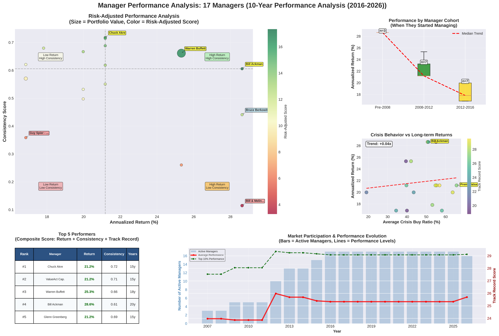

#### 3 Year Performance
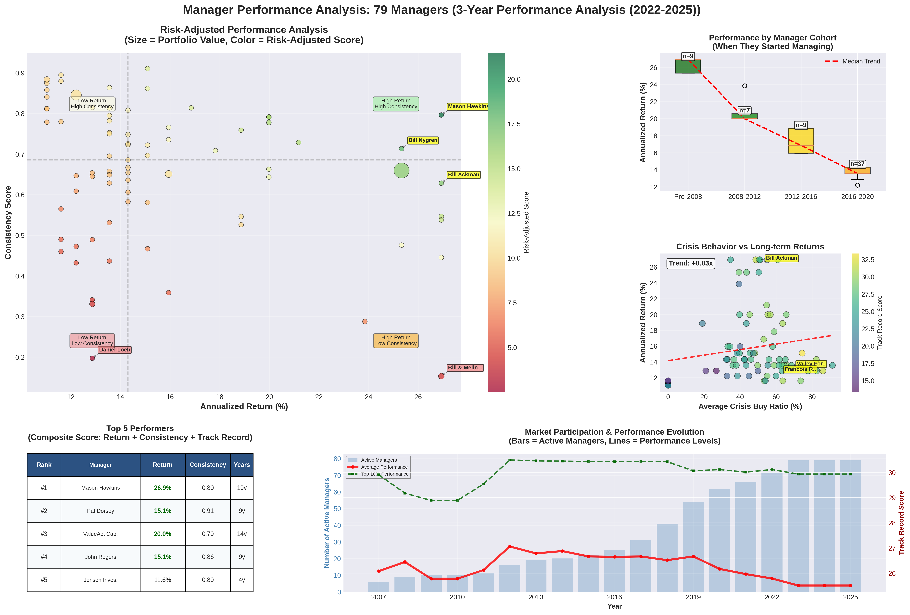

#### 5 Year Performance
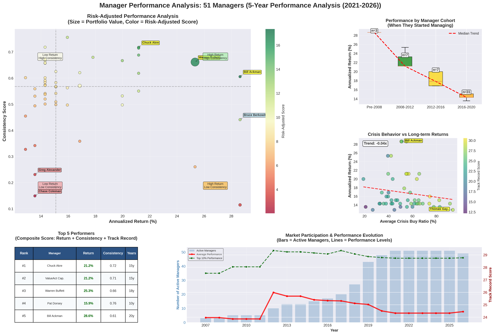

#### Comprehensive Performance
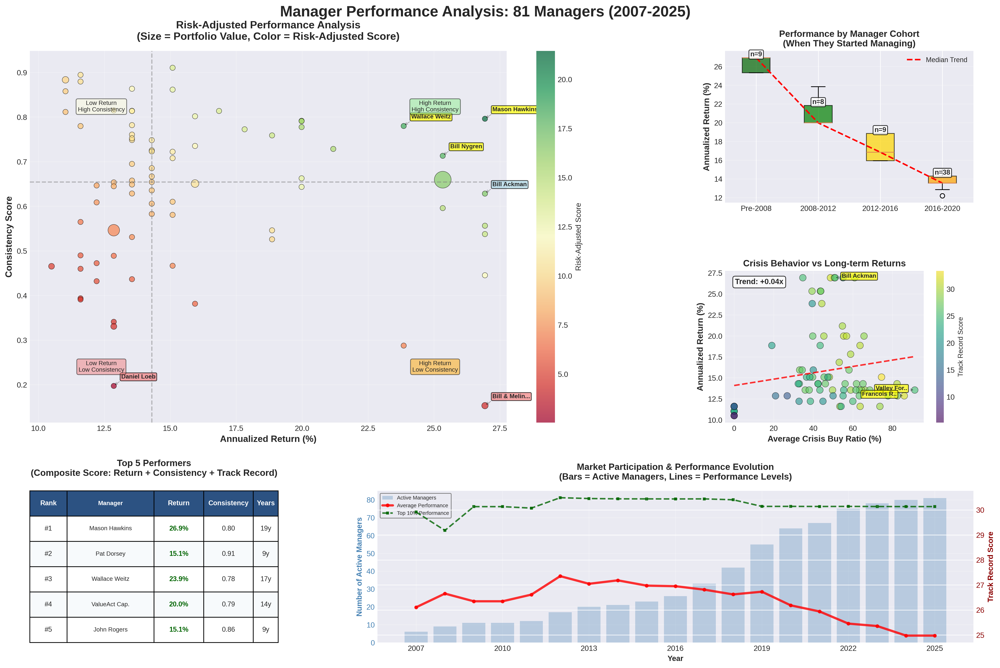

#### Consensus Picks Advanced
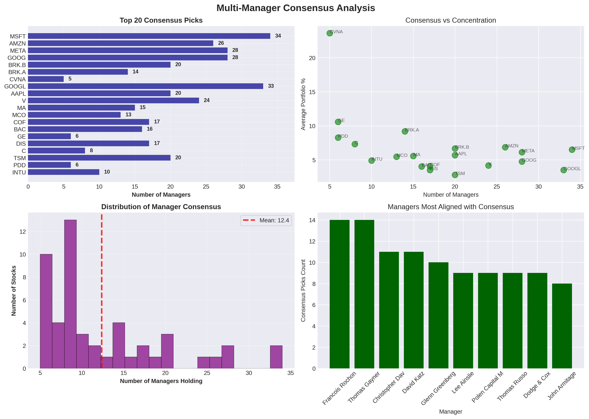

#### Crisis Alpha Advanced
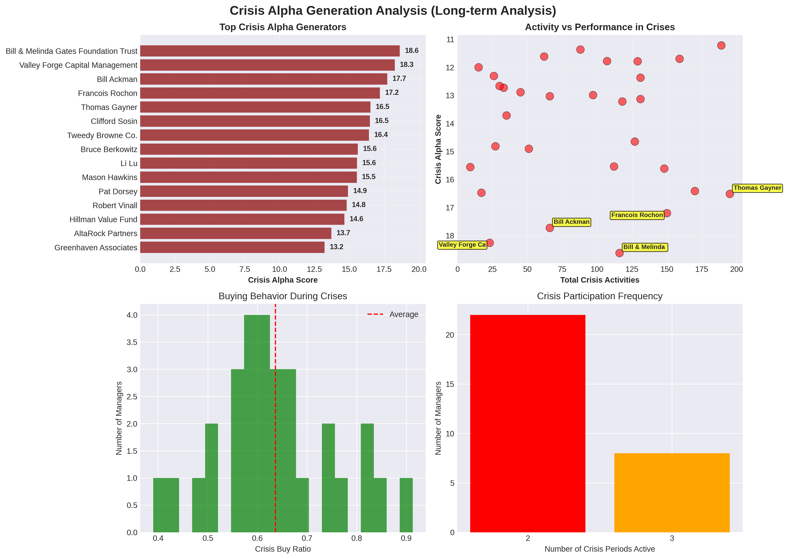

#### Manager Evolution Advanced
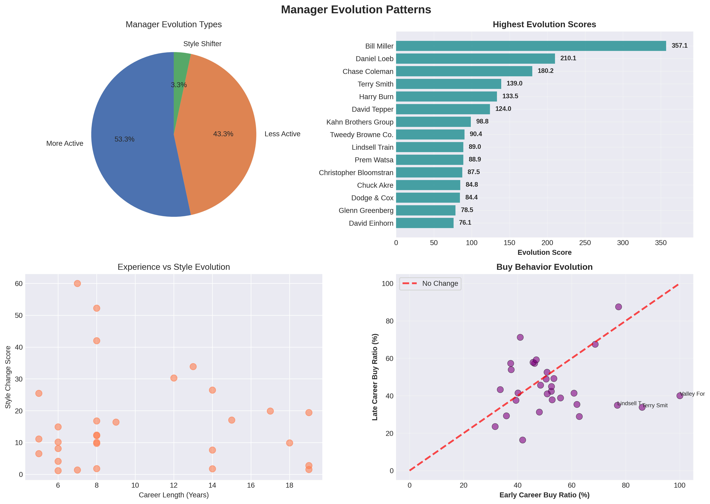

#### Manager Performance Advanced
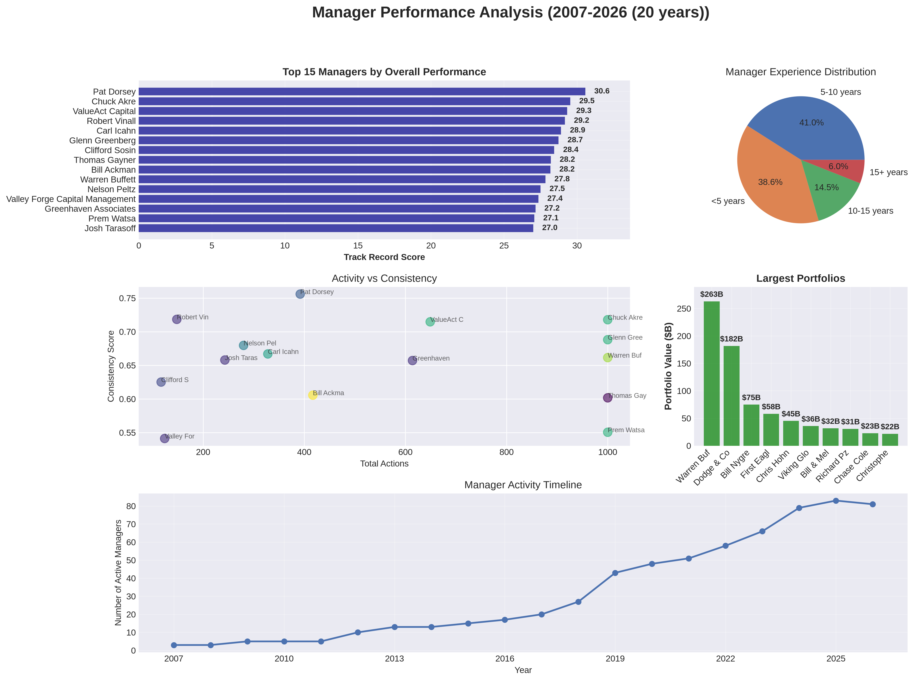

#### Position Sizing Advanced
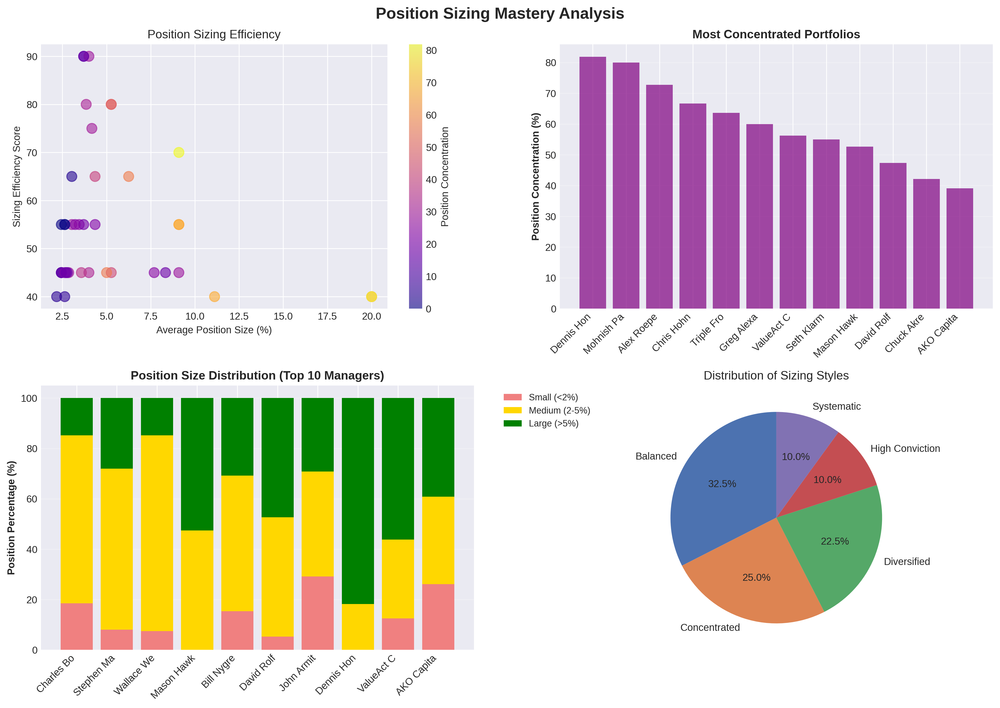

#### Top Holdings Advanced
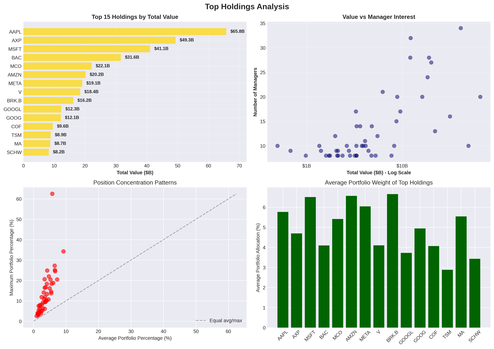

### 📋 Advanced Reports

| Report | Description | Key Insight |
| ------ | ----------- | ----------- |
| [position_building_timeline.csv](advanced/position_building_timeline.csv) | 📈 Position buildup/reduction over time (45322 items) | Quarter-by-quarter view of how managers accumulate & distribute positions |
| [accumulation_vs_distribution.csv](advanced/accumulation_vs_distribution.csv) | 🔄 Current phase tracking (100 items) | Identifies which positions are being built vs reduced RIGHT NOW |
| [position_flip_points.csv](advanced/position_flip_points.csv) | 🔀 Accumulation→Distribution transitions (96 items) | Pinpoints when managers switched from building to reducing |
| [action_sequence_patterns.csv](advanced/action_sequence_patterns.csv) | Trading pattern analysis (30 items) | Institutional buy/sell sequence patterns |
| [catalyst_timing_masters.csv](advanced/catalyst_timing_masters.csv) | Market timing excellence (30 items) | Managers with exceptional timing skills |
| [crisis_alpha_generators.csv](advanced/crisis_alpha_generators.csv) | Crisis period outperformers (30 items) | Managers who buy during crashes |
| [high_conviction_stocks.csv](advanced/high_conviction_stocks.csv) | Highest conviction positions (260 items) | Stocks with strongest institutional backing |
| [interesting_stocks_overview.csv](advanced/interesting_stocks_overview.csv) | Top-tier opportunities (100 items) | Multi-factor scoring of elite picks |
| [long_term_winners.csv](advanced/long_term_winners.csv) | Sustained institutional interest (123 items) | Stocks with long-term institutional backing |
| [manager_evolution_patterns.csv](advanced/manager_evolution_patterns.csv) | Strategy adaptation over time (30 items) | How managers evolve their approaches |
| [manager_performance.csv](advanced/manager_performance.csv) | Comprehensive manager evaluation (81 items) | Multi-dimensional performance metrics |
| [manager_track_records.csv](advanced/manager_track_records.csv) | 18+ year performance history (81 items) | Comprehensive manager scoring with consistency |
| [multi_manager_favorites.csv](advanced/multi_manager_favorites.csv) | Consensus high-conviction picks (50 items) | Stocks held by multiple elite managers |
| [position_sizing_mastery.csv](advanced/position_sizing_mastery.csv) | Optimal allocation patterns (40 items) | Advanced portfolio construction analysis |
| [sector_rotation_excellence.csv](advanced/sector_rotation_excellence.csv) | Elite sector allocation (30 items) | Superior sector rotation strategies |
| [sector_rotation_patterns.csv](advanced/sector_rotation_patterns.csv) | Institutional sector flows (353 items) | Sector rotation trend analysis |
| [theme_emergence_detection.csv](advanced/theme_emergence_detection.csv) | Early theme identification (25 items) | Emerging investment theme detection |
| [top_holdings.csv](advanced/top_holdings.csv) | Largest institutional positions (50 items) | Deep dive into major institutional holdings |

### 🏆 Top 15 Managers by Annual Return (2007-2025)

| Rank | Manager | Annual Return | Score | Years Active |
| ---- | ------- | ------------- | ----- | ------------ |
| 1 | **Mason Hawkins** | 26.9% | 31.49 | 19 |
| 2 | **Bill Ackman** | 26.9% | 28.34 | 19 |
| 3 | **Tweedy Browne Co.** | 26.9% | 27.92 | 19 |
| 4 | **Ruane Cunniff** | 26.9% | 24.92 | 19 |
| 5 | **Bruce Berkowitz** | 26.9% | 24.71 | 19 |
| 6 | **Bill & Melinda Gates Foundation Trust** | 26.9% | 19.26 | 19 |
| 7 | **Bill Nygren** | 25.3% | 28.60 | 18 |
| 8 | **Warren Buffett** | 25.3% | 27.95 | 18 |
| 9 | **Hillman Value Fund** | 25.3% | 26.70 | 18 |
| 10 | **Wallace Weitz** | 23.9% | 30.13 | 17 |
| 11 | **Mohnish Pabrai** | 23.9% | 19.80 | 17 |
| 12 | **Glenn Greenberg** | 21.2% | 29.55 | 15 |
| 13 | **ValueAct Capital** | 20.0% | 30.57 | 14 |
| 14 | **Chuck Akre** | 20.0% | 30.43 | 14 |
| 15 | **Charles Bobrinskoy** | 20.0% | 29.55 | 14 |

---

## 📚 Historical Analysis (18+ Years)

Long-term trends and patterns from 2007 to 2025.

### 📊 Visual Analysis

#### Crisis Response Comparison
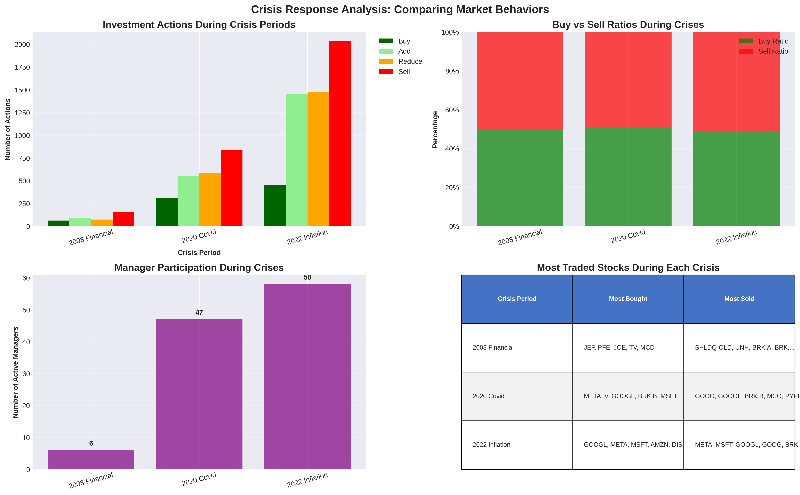

#### Multi Decade Conviction
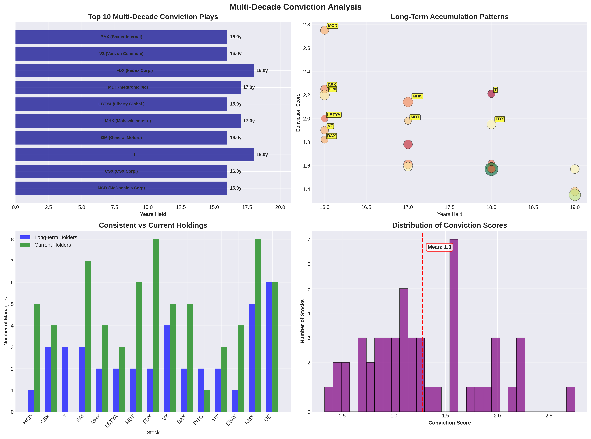

#### Quarterly Activity Timeline
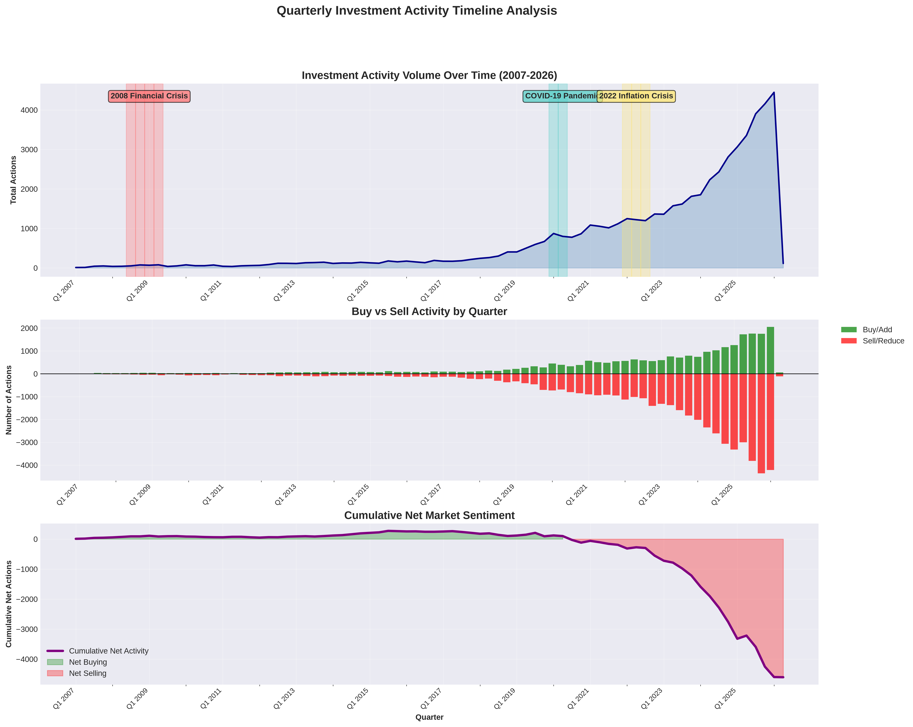

#### Stock Life Cycles
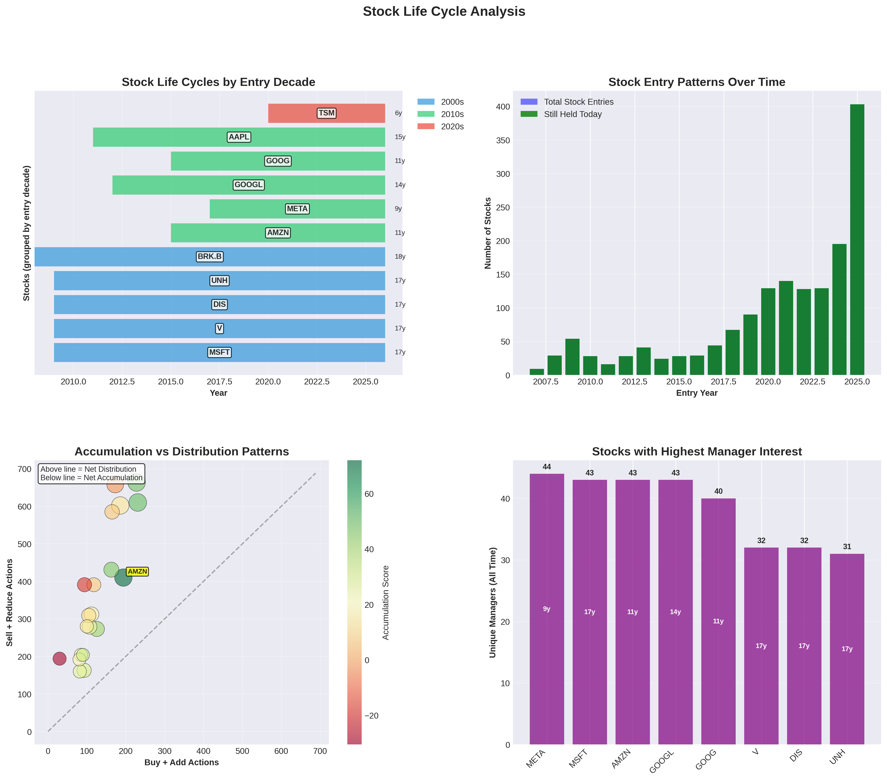

### 📋 Historical Reports

| Report | Description | Key Insight |
| ------ | ----------- | ----------- |
| [crisis_response_analysis.csv](historical/crisis_response_analysis.csv) | 2008 vs 2020 comparison (3 items) | Crisis behavior patterns across decades |
| [multi_decade_conviction.csv](historical/multi_decade_conviction.csv) | Stocks held 10+ years (50 items) | Ultimate long-term conviction plays |
| [quarterly_activity_timeline.csv](historical/quarterly_activity_timeline.csv) | 18-year activity map (75 items) | 73 quarters of market timing insights |
| [stock_life_cycles.csv](historical/stock_life_cycles.csv) | Complete holding patterns (1605 items) | Entry/exit patterns and optimal holding periods |

---

## 📐 Methodology

### Scoring Algorithms

#### Hidden Gem Score (0-10)
- **Exclusivity Factor** (30%): Fewer managers = higher score
- **Conviction Factor** (25%): Higher portfolio % = higher score
- **Recent Activity** (20%): Recent buys boost score
- **Momentum Factor** (15%): Multiple recent transactions
- **Manager Quality** (10%): Premium for top-tier managers

#### Track Record Score
- **Win Rate**: Percentage of successful investments
- **Consistency**: Performance stability over time
- **Crisis Alpha**: Outperformance during downturns
- **Longevity**: Years of active management

### Data Processing
- **Temporal Accuracy**: 100% validated quarter extraction
- **Price Data**: Real-time from Dataroma HTML
- **Manager Mapping**: Clean names without timestamps
- **Activity Types**: Buy, Sell, Add, Reduce, Hold

### Analysis Periods
- **Current**: Last 3 quarters
- **Historical**: Q1 2007 - Present (18+ years)

## Understanding the Data

This section provides context for interpreting the analysis results, including edge cases and cross-file relationships.

### Momentum Analysis Details

The momentum analysis tracks institutional accumulation and distribution patterns. Higher scores indicate stronger buying pressure from multiple managers.

#### Top 20 Momentum Stocks

| Ticker | Company | Score | Buy Actions | Holders | Type |
| ------ | ------- | ----- | ----------- | ------- | ---- |
| **MSFT** | Microsoft Corp. | 104.0 | 29 | 35 | Recent Surge |
| **GOOGL** | Alphabet Inc. | 93.4 | 26 | 32 | Recent Surge |
| **META** | Meta Platforms Inc. | 92.9 | 27 | 29 | Recent Surge |
| **AMZN** | Amazon.com Inc. | 91.0 | 27 | 25 | Recent Surge |
| **UNH** | United Health Group Inc. | 77.5 | 27 | 17 | Recent Surge |
| **NVDA** | NVIDIA Corp. | 74.5 | 26 | 14 | Recent Surge |
| **TSM** | Taiwan Semiconductor S.A. | 72.8 | 22 | 21 | Recent Surge |
| **GOOG** | Alphabet Inc. CL C | 71.8 | 17 | 27 | Recent Surge |
| **V** | Visa Inc. | 65.4 | 16 | 24 | Recent Surge |
| **IEP** | Icahn Enterprises | 57.8 | 2 | 1 | Moderate |
| **BRK.B** | Berkshire Hathaway CL B | 57.4 | 13 | 19 | Recent Surge |
| **DIS** | Walt Disney Co. | 55.1 | 15 | 17 | Recent Surge |
| **AAPL** | Apple Inc. | 54.2 | 12 | 19 | Recent Surge |
| **FISV** | Fiserv Inc. | 50.8 | 16 | 12 | Recent Surge |
| **COF** | Capital One Financial | 49.4 | 12 | 17 | Recent Surge |
| **CVNA** | Carvana Co. | 43.2 | 6 | 6 | Recent Surge |
| **FLUT** | Flutter Entertainment Plc | 41.9 | 12 | 8 | Recent Surge |
| **LEN** | Lennar Corp. | 40.8 | 12 | 4 | Recent Surge |
| **FERG** | Ferguson Enterprises Inc. | 40.5 | 12 | 9 | Recent Surge |
| **HCC** | Warrior Met Coal Inc. | 40.0 | 6 | 2 | Recent Surge |

**Interpretation:**
- **Recent Surge**: Strong recent accumulation across multiple quarters
- **Consistent Buyer**: Steady accumulation pattern over time
- **New Interest**: Fresh positions being established

### 52-Week Analysis Edge Cases

The 52-week high/low analyses use specific filter criteria that may initially seem counterintuitive:

#### 52-Week Low Buys (`52_week_low_buys.csv`)

This report shows stocks being **bought near their 52-week lows**. The `near_52w_low=True` filter is **intentional** - these are the exact stocks we want to highlight as potential value opportunities.

- **40 stocks** currently meet this criterion
- Examples: KHC, DVA, FISV
- These are being accumulated by value-focused managers

#### 52-Week High Sells (`52_week_high_sells.csv`)

This report shows stocks being **sold near their 52-week highs**. The `near_52w_high=True` filter is **intentional** - these represent profit-taking opportunities where managers are locking in gains.

- **40 stocks** currently meet this criterion
- Examples: AAPL, AXP, BAC
- 34 stocks show "Heavy Distribution" patterns

### New Positions Context

The analysis identified **100 new position entries** in the last 3 quarters. These represent fresh institutional interest.

#### Top New Positions by Total Value

| Ticker | Managers Initiating | Total Value | Avg Portfolio % |
| ------ | ------------------- | ----------- | --------------- |
| **GOOGL** | Warren Buffett | $4.34B | 1.62% |
| **AVGO** | Polen Capital Management, Stephen Mandel | $1.99B | 4.26% |
| **MSFT** | Viking Global Investors | $1.26B | 3.27% |
| **AON** | Dodge & Cox, Viking Global Investors | $1.15B | 0.93% |
| **NFLX** | Viking Global Investors, Chase Coleman | $842.50M | 1.16% |
| **UNP** | Seth Klarman, Lee Ainslie +1 more | $824.18M | 4.48% |
| **INTU** | Polen Capital Management, Viking Global Investors | $632.28M | 0.97% |
| **ADM** | Dodge & Cox | $597.82M | 0.50% |
| **DKNG** | Viking Global Investors | $561.12M | 1.46% |
| **WDAY** | First Eagle Investment Management | $556.25M | 1.01% |

### Cross-File Context

Some stocks appear in multiple analysis files with seemingly contradictory signals. This is normal and reflects the diverse strategies of different managers.

#### Stocks in Both Contrarian and Momentum Reports

These tickers appear in both `contrarian_opportunities.csv` and `momentum_stocks.csv`. This happens when different managers take opposite positions on the same stock:

- **AMZN**: Contrarian signal: Net Selling (buys: 27.0, sells: 34.0) | Momentum score: 91.046

- **COF**: Contrarian signal: Net Selling (buys: 12.0, sells: 31.0) | Momentum score: 49.44294117647059

- **CP**: Contrarian signal: Net Selling (buys: 10.0, sells: 12.0) | Momentum score: 35.51571428571428

- **BAC**: Contrarian signal: Net Selling (buys: 8.0, sells: 25.0) | Momentum score: 39.92133333333334

- **UBER**: Contrarian signal: Mixed Signal (buys: 11.0, sells: 11.0) | Momentum score: 39.8

#### New Positions with Contrarian Signals

These newly initiated positions also show contrarian patterns, suggesting managers are taking bold positions against the crowd:
- **MSFT**: New position initiated amid contrarian activity
- **FISV**: New position initiated amid contrarian activity
- **TSM**: New position initiated amid contrarian activity

### Data Freshness Notes

**Analysis Window**: Last 3 quarters

All current analysis reports are based on manager filings within this window. Key points to understand:

1. **Filing Lag**: SEC 13F filings are reported quarterly with a 45-day delay. Positions may have changed since filing.

2. **Historical Reference Columns**: Some reports include columns like `last_buy_period`, `first_established`, or `last_activity`. These may show dates outside the 3-quarter window - this is intentional to provide historical context.

3. **Price Data**: Current prices are from the most recent scrape and may differ from the prices at which positions were established.

4. **Manager Activity**: A single manager may have multiple entries for the same stock if they made multiple transactions (Buy, Add, Reduce) within the analysis window.

**Report Generated**: 2026-01-27 00:09:19

---

## 📅 Update Schedule

This analysis is refreshed monthly to capture the latest investment trends and manager activities.

## 🔗 Data Source

All data is sourced from [Dataroma](https://www.dataroma.com), tracking portfolios of super investors.

---

*Analysis framework powered by modular Python architecture with 100% data accuracy validation*